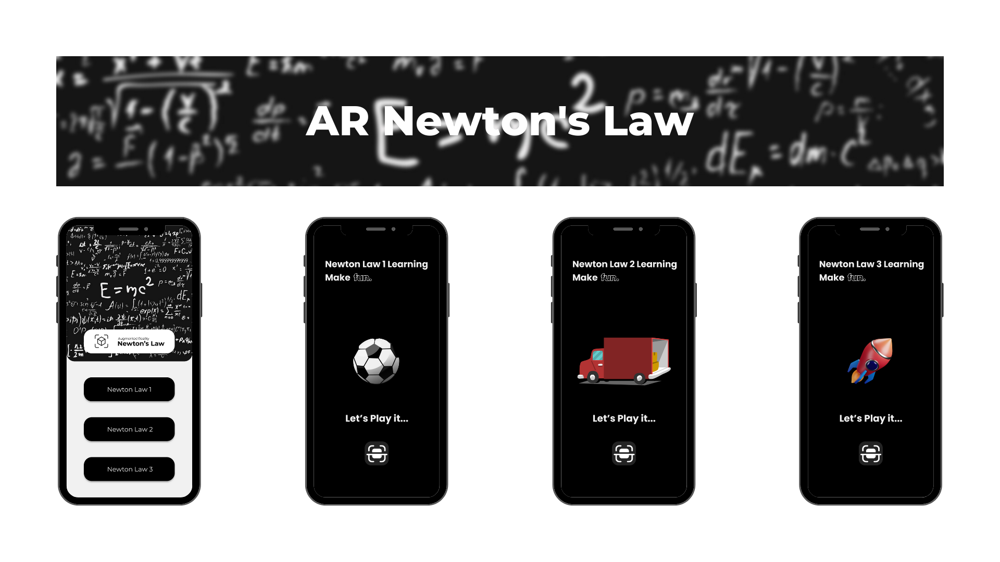
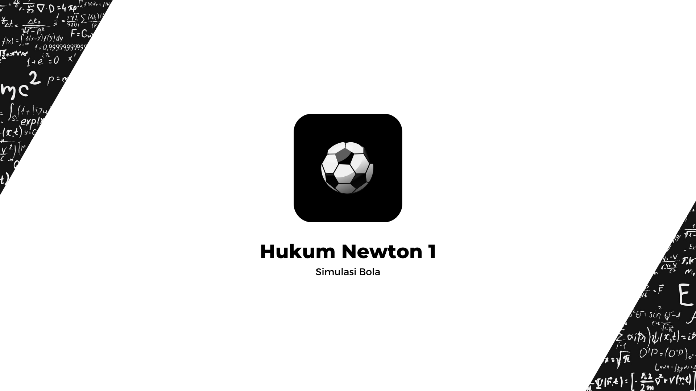
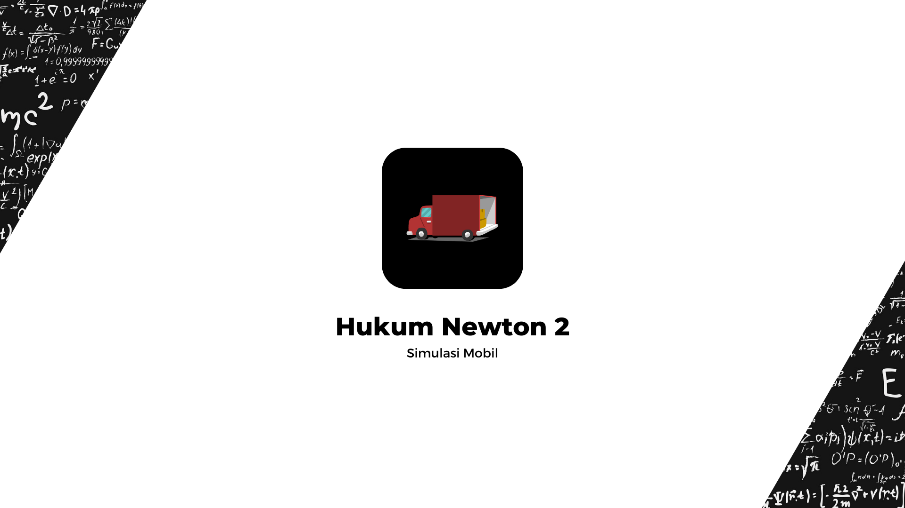
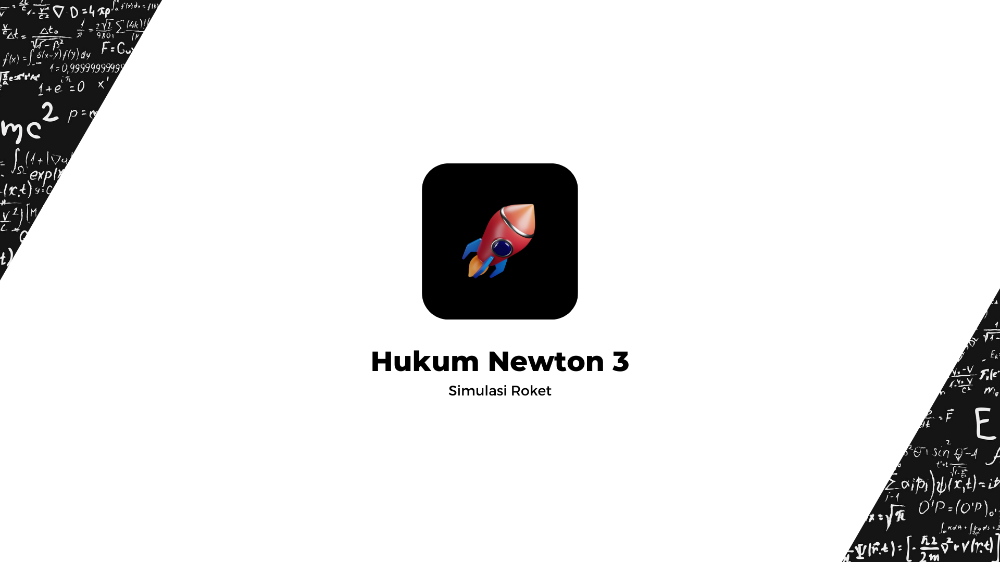
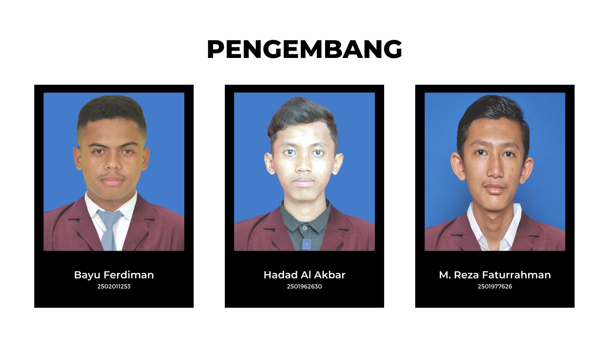

# AR Newton's Law

Proyek AR Hukum Newton 1, 2, dan 3 memiliki tujuan untuk memvisualisasikan dan mempelajari konsep-konsep fisika yang mendasar dalam Hukum Newton 1, 2, dan 3 melalui penggunaan teknologi Augmented Reality (AR). Proyek ini menggunakan game engine Unity dan SDK ARCore untuk menciptakan pengalaman AR yang interaktif.

## 3D Model

Nantinya, akan terdapat 3 simulasi yang tersedia dan 3D model yang digunakan adalah sebagai berikut:

- Bola
- Mobil
- Roket

Sumber 3D Model:
- [Free Sports Kit](https://assetstore.unity.com/packages/3d/characters/free-sports-kit-239377)
- [Vehicle](https://learn.unity.com/tutorial/set-up-your-first-project-in-unity?uv=2021.3&projectId=5caccdfbedbc2a3cef0efe63)
- [Meshtint Free City Lite Pack Mega Toon Series](https://assetstore.unity.com/packages/3d/environments/urban/meshtint-free-city-lite-pack-mega-toon-series-152378)
- [Atom Rocket Model](https://assetstore.unity.com/packages/3d/vehicles/space/atom-rocket-model-140021)
- [Particle Pack](https://assetstore.unity.com/packages/vfx/particles/particle-pack-127325)

## Simulasi Hukum Newton 1, 2, dan 3

**Hukum Newton 1**, objek bola digunakan untuk memvisualisasikan Hukum Newton 1, yaitu hukum inersia. Pengguna dapat melempar bola ke udara dan melihat bagaimana bola tetap bergerak dengan kecepatan konstan kecuali jika ada gaya yang bekerja padanya.

**Hukum Newton 2**, objek mobil digunakan untuk memvisualisasikan Hukum Newton 2, yaitu hukum aksi-reaksi. Pengguna dapat menempatkan mobil di atas permukaan datar dan menekan pedal gas untuk melihat bagaimana mobil mulai bergerak dan mengalami gaya gesek yang berlawanan arah.

**Hukum Newton 3**, objek roket digunakan untuk memvisualisasikan Hukum Newton 3, yaitu hukum aksi-reaksi. Pengguna dapat melemparkan roket ke udara dan melihat bagaimana roket bergerak dengan gaya yang sama. Namun, berlawanan arah dengan gaya dorong yang dihasilkan oleh mesin roket.

## Rencana Pengembangan

- Proyek Awal. ✅
- Menambahkan Scene Home Page. ✅
- Menambahkan Scene Newton 1 Intro, Play, dan Quiz. ✅
- Menambahkan Scene Newton 2 Intro, Play, dan Quiz. ✅
- Menambahkan Scene Newton 3 Intro, Play, dan Quiz. ✅
- Mengubah Icon atau Logo dan Versi Aplikasi.

## Mockup

Figma : [Wireframes + Mockup](https://www.figma.com/file/nbnUcL2L7NkyHyptQOgRMF/AR-Newton's-Law?type=design&node-id=302%3A9&t=umw56azSORDk3k07-1)

## Demo

Coming Soon.

## Persyaratan Sistem

- Minimal Android 8 "Oreo".
- Pastikan SmartPhone Anda dapat menjalankan atau kompatibel dengan syarat terdapat "Google Play Services for AR" di Play Store Anda.

## Dokumentasi

YouTube: Coming Soon.

## Pengembang

